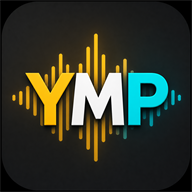

# YMPlayer

  

**YMPlayer** - неофициальный музыкальный и видеоплеер для Яндекс Музыки на
Android 10 и новее. Приложение рассчитано на смартфоны, Android TV и автомобильные
магнитолы, поддерживает системные медиакнопки и делает основной упор на
"Мою волну", оффлайн-избранное и удобное управление в дороге.

Текущая версия: **1.0.0-beta.7**. Основные функции завершены; статус beta оставлен
для длительного тестирования на разных устройствах и версиях сервисов Яндекса.

## Скачать

- [YMPlayer 1.0.0-beta.7 в GitHub Releases](https://github.com/reziarlleh/YMPlayer/releases/tag/v1.0.0-beta.7)
- [Скачать APK](https://github.com/reziarlleh/YMPlayer/releases/download/v1.0.0-beta.7/YMPlayer-v1.0.0-beta.7-release-b107.apk)
- [APK в архиве репозитория](releases/1.0.0-beta.7/YMPlayer-v1.0.0-beta.7-release-b107.apk)

APK поддерживает обновление ранее установленных версий YMPlayer без очистки
настроек, авторизации и локального кэша.

## Возможности

### Музыка

- Динамическое воспроизведение "Моей волны" с подготовкой следующего трека.
- Воспроизведение понравившихся треков без интернета.
- Постоянный офлайн-кэш обложек избранного с отдельной операцией синхронизации.
- Раздельное качество онлайн-потока и постоянного оффлайн-кэша.
- Плейлисты из коллекции аккаунта Яндекс Музыки: воспроизведение, создание,
  добавление треков и удаление.
- Локальные плейлисты для файлов во внутренней памяти и на USB-накопителях.
- Поиск треков, альбомов и исполнителей с обложками и быстрыми действиями.
- Лайк, дизлайк, предыдущий/следующий трек, стоп, случайный порядок и повтор.
- Передача названия, исполнителя и обложки в Android, уведомление и
  автомобильные лаунчеры.

### Волна клипов

- Полноэкранная динамическая очередь музыкальных клипов.
- Плавный переход к заранее подготовленному следующему клипу.
- Перемотка, прогресс и время воспроизведения.
- Краткий оверлей с названием и исполнителем в начале каждого клипа.
- Предыдущий/следующий клип, пауза и лайк связанного музыкального трека.
- Опциональное автоскрытие системных панелей Android.

### Android TV

- Управление крестовиной пульта, кнопкой OK, мышью и сенсорным экраном.
- Хорошо заметный фокус на кнопках, списках, поиске и настройках.
- Отдельная кнопка перехода к поиску и плейлистам рядом с настройками.
- Автоскрытие системных панелей не применяется на Android TV, чтобы меню
  телевизора всегда восстанавливалось после выхода из Волны клипов.

### Автомобильный режим

- `MediaSession` и `MediaBrowserService`: YMPlayer определяется Android как
  медиаплеер и может использоваться в CarWebGuru и других совместимых
  лаунчерах.
- Встроенный SideBar для магнитол TS18 с вытягиванием от края экрана.
- Крупные кнопки громкости, mute, Home, Back, сна и перезагрузки.
- Настраиваемое автоскрытие SideBar.
- Быстрый переход к выбранному приложению EQ/DSP.

## Установка и первый запуск

1. Установите APK на устройство с Android 10 или новее.
2. Откройте настройки YMPlayer, запишите показанный код устройства и затем
   нажмите «Войти через Яндекс».
3. При необходимости выберите качество онлайн-воспроизведения и кэша.
4. Включите автоматическое скачивание понравившихся треков или запустите
   синхронизацию вручную.
5. Выберите "Моя волна", "Режим оффлайн" или плейлист и нажмите Play.

Выбор нового источника не запускает музыку сам: текущее воспроизведение
останавливается, а выбранный режим ожидает нажатия Play.

## Оффлайн-кэш

Постоянно хранятся только треки из единого раздела "Мне нравится" аккаунта
Яндекс Музыки. Не имеет значения, где был поставлен лайк: в волне, поиске,
альбоме или плейлисте.

Снятие лайка или дизлайк удаляет трек из постоянного кэша. Остальная музыка
может временно кэшироваться для плавного воспроизведения и экономии трафика,
но этот временный кэш ограничен по размеру.

Настоящие обложки избранных треков сохраняются отдельно от аудио и доступны
офлайн. Логотип YMPlayer используется только как экранная заглушка и никогда
не записывается в музыкальный файл вместо отсутствующей обложки.

## Локальная музыка

YMPlayer использует системный механизм доступа Android к выбранному хранилищу,
после чего файлы и папки можно отмечать во встроенном браузере приложения.
Недоступные файлы, например с отключённой USB-флешки, безопасно пропускаются и
снова становятся доступны после подключения накопителя.

Для локальной музыки существует неудаляемый плейлист "Локальное избранное".
Если в файле нет обложки, приложение может попытаться найти её в открытых
источниках и записать в метаданные, когда хранилище разрешает изменение файла.

## Диагностика

В настройках можно скопировать журнал или сохранить его текстовым файлом с
датой и временем в папку `Downloads`. Это помогает разбирать редкие ошибки
сети, конкретной прошивки магнитолы или изменений сервиса Яндекса.

## Важно

- YMPlayer не является официальным приложением Яндекса.
- Для онлайн-функций требуется действующий аккаунт и доступ к Яндекс Музыке.
- Доступность полных видеопотоков может зависеть от региона, подписки и
  текущих правил сервиса. Защищённый DRM-контент приложение не обходит.
- Токен авторизации и кэш сохраняются только в данных приложения на устройстве.

История версий: [CHANGELOG.md](CHANGELOG.md).

Планы новых функций: [ROADMAP.md](ROADMAP.md).
